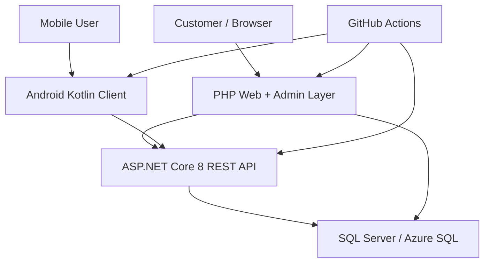

# Elaro

[](https://github.com/Yakup24/Elaro/actions/workflows/ci.yml)

**Elaro** is a portfolio-ready, multi-client e-commerce monorepo that combines an ASP.NET Core API, a PHP web/admin layer, an Android Kotlin client, SQL Server database scripts, CI quality gates, and production-oriented security documentation.

The project is designed to demonstrate more than basic CRUD. It shows how an e-commerce system can be split into independently buildable runtimes while keeping authentication, database access, deployment configuration, secret handling, and release readiness visible in one repository.

## Problem

Small e-commerce projects often become hard to maintain when backend, web admin, mobile client, database scripts, and deployment notes are scattered across separate folders or personal machines. That creates common risks:

- API, web, and mobile clients drift from each other.
- Database schema changes are not versioned clearly.
- Secrets or deployment values accidentally leak into source control.
- Admin authorization is implemented with fragile hard-coded values.
- Payment and session handling are not documented.
- CI only checks one layer while other layers silently break.

## Solution

Elaro keeps the core delivery surfaces in one monorepo:

- ASP.NET Core 8 API for REST endpoints, JWT authentication, EF Core and SQL Server integration
- PHP web/admin layer for storefront and operational screens
- Android Kotlin client for mobile shopping flows
- SQL Server schema and seed scripts for repeatable setup
- Docker and environment examples for local/deployment preparation
- CI pipeline covering API, PHP, Android and secret scanning
- Documentation for architecture, deployment, release and quality strategy

## Core Features

- Customer registration and login
- JWT-based API authentication
- Role-based admin access
- Product, cart, order and profile-oriented e-commerce flow
- PHP storefront and admin panel
- Android client with Retrofit/OkHttp integration
- SQL Server / Azure SQL compatible database layer
- Environment-based configuration
- CSRF protection for PHP forms
- Hardened PHP session cookie settings
- BCrypt-compatible password hashing
- Masked payment card handling guidance
- CI checks for API tests, PHP syntax, Android build/tests and leaked value guard

## Architecture



More detail is available in [docs/ARCHITECTURE.md](docs/ARCHITECTURE.md).

## Components

| Component | Stack | Location | Responsibility |
|---|---|---|---|
| API | ASP.NET Core 8, EF Core, SQL Server | `ElaroAPI/ElaroApi` | REST API, auth, business operations |
| API tests | xUnit | `ElaroAPI/ElaroApi.Tests` | Automated backend checks |
| Web/Admin | PHP, PDO `sqlsrv` | `ElaroWeb` | Storefront and admin workflows |
| Mobile | Android, Kotlin, Retrofit/OkHttp | `ElaroMobil` | Mobile client experience |
| Database | SQL Server scripts | `database` | Schema and seed bootstrap |
| CI/CD | GitHub Actions | `.github/workflows` | Build, test, lint and secret guard |
| Docs | Markdown | `docs` | Architecture, deployment and release process |

## Repository Layout

```text
Elaro/
|-- ElaroAPI/       # ASP.NET Core REST API and xUnit tests
|-- ElaroWeb/       # PHP web app and admin panel
|-- ElaroMobil/     # Android client
|-- database/       # SQL Server schema and seed scripts
|-- docs/           # Architecture, deployment, quality and release docs
|-- .github/        # CI, Dependabot and ownership config
|-- docker-compose.yml
|-- .env.example
|-- LICENSE
`-- SECURITY.md
```

## Requirements

- .NET SDK 8
- PHP 8.2+ with `pdo_sqlsrv` / `sqlsrv`
- SQL Server 2022 or Azure SQL
- Android Studio with JDK 17
- Docker Desktop, optional

## Configuration

Secrets must stay outside the repository. Use `.env.example` as the key list and provide real values through environment variables, user secrets, GitHub Secrets, or your hosting provider.

API keys:

```bash
ConnectionStrings__DefaultConnection="Server=...;Database=...;User ID=...;Password=...;Encrypt=True;TrustServerCertificate=False;"
Jwt__Issuer="Elaro"
Jwt__Audience="ElaroClients"
Jwt__Key="replace-with-a-32-byte-minimum-random-secret"
Jwt__AccessTokenMinutes="60"
Cors__AllowedOrigins__0="http://localhost"
```

PHP keys:

```bash
ELARO_DB_HOST=
ELARO_DB_NAME=
ELARO_DB_USER=
ELARO_DB_PASSWORD=
```

Android key:

```bash
ELARO_API_BASE_URL=https://your-api.example.com/
```

## Quick Start

Restore and test the API:

```bash
dotnet restore ElaroAPI/ElaroApi.sln
dotnet test ElaroAPI/ElaroApi.sln -c Release
dotnet run --project ElaroAPI/ElaroApi
```

Run the PHP web layer:

```bash
php -S localhost:8080 -t ElaroWeb
```

Build the Android app:

```bash
cd ElaroMobil
./gradlew assembleDebug
```

Start the local Docker stack:

```bash
docker compose up --build
```

## Database

The portable SQL Server bootstrap files live in `database/`.

```bash
sqlcmd -S localhost,1433 -U sa -P "<password>" -i database/schema.sql
sqlcmd -S localhost,1433 -U sa -P "<password>" -d Elaro -i database/seed.sql
```

## Quality Gates

The CI workflow is designed to catch failures across the monorepo, not only one runtime:

- API restore, build and xUnit test execution
- API test result artifact upload
- PHP syntax linting
- Android debug build
- Android unit tests
- Secret guard for known leaked values and private deployment strings

See [docs/QUALITY_STRATEGY.md](docs/QUALITY_STRATEGY.md) for the full testing and quality approach.

## Security

- Database credentials, JWT keys, publish profiles, keystores and `.env` files are ignored.
- API authentication uses JWT bearer tokens and role claims for customer/admin access.
- API login and general endpoints are rate limited.
- CORS is configured with explicit allowed origins.
- API and PHP password hashes use BCrypt-compatible storage.
- PHP admin authorization uses the `Musteri2.Role = Admin` database role instead of an environment-selected email.
- PHP forms use CSRF tokens and hardened session cookie settings.
- Payment card numbers are masked and CVV values must not be stored permanently.
- Known leaked deployment values are blocked by the CI secret guard.
- PHP route filenames are ASCII-safe for cross-platform deploys.

Report vulnerabilities through [SECURITY.md](SECURITY.md).

## Documentation

- [Architecture](docs/ARCHITECTURE.md)
- [Quality strategy](docs/QUALITY_STRATEGY.md)
- [Operations runbook](docs/RUNBOOK.md)
- [Deployment](docs/DEPLOYMENT.md)
- [Release checklist](docs/RELEASE_CHECKLIST.md)
- [Latest release notes](docs/releases/v0.2.2.md)
- [Changelog](CHANGELOG.md)
- [Contributing](CONTRIBUTING.md)
- [Code of Conduct](CODE_OF_CONDUCT.md)

## Roadmap

- Add OpenAPI/Swagger contract snapshots
- Add API integration tests with disposable SQL Server container
- Add PHP form-level smoke tests
- Add Android UI smoke tests
- Add structured application logs and correlation IDs
- Add order lifecycle audit trail
- Add payment provider abstraction for sandbox integrations

## Authors

- [Yakup Eski](https://github.com/Yakup24)
- [Berat Kurucay](https://github.com/BeratKurucay)

## License

This project is licensed under the MIT License. See [LICENSE](LICENSE).
