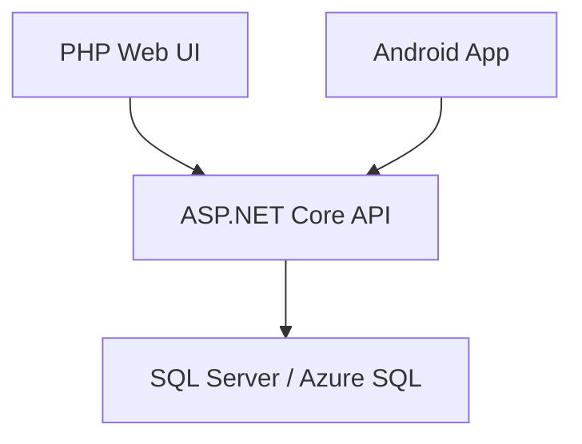

# Architecture

Elaro is a three-client e-commerce monorepo. The repository is intentionally split by runtime so each component can be built and deployed independently.

## API

- Location: `ElaroAPI/ElaroApi`
- Runtime: ASP.NET Core 8
- Data access: EF Core SQL Server provider
- Security defaults: environment-based connection string, configured CORS origins, rate limiting, secure response headers, Swagger disabled in production by default

## Web

- Location: `ElaroWeb`
- Runtime: PHP
- Data access: PDO `sqlsrv`
- Security defaults: database credentials from environment variables, admin session guard, password hashing, no persistent CVV storage

## Mobile

- Location: `ElaroMobil`
- Runtime: Android Kotlin
- Network configuration: API base URL is injected through `ELARO_API_BASE_URL` or Gradle property

## Operational Boundaries

- Secrets never live in source control.
- Production configuration belongs in platform secret stores or environment variables.
- CI validates buildability and blocks known leaked values.
