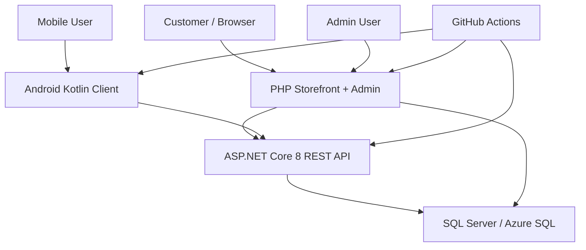

# Architecture

Elaro is a multi-client e-commerce monorepo. The repository is intentionally split by runtime so each component can be built, tested and deployed independently while still sharing one documented product boundary.

## System Context


```mermaid
flowchart TD
    Customer["Customer / Browser"] --> Web["PHP Storefront + Admin"]
    MobileUser["Mobile User"] --> Android["Android Kotlin Client"]
    Web --> Api["ASP.NET Core 8 REST API"]
    Android --> Api
    Api --> Db["SQL Server / Azure SQL"]
    Web --> Db
    Admin["Admin User"] --> Web
    CI["GitHub Actions"] --> Api
    CI --> Web
    CI --> Android
```

## Runtime Boundaries

### API

- Location: `ElaroAPI/ElaroApi`
- Runtime: ASP.NET Core 8
- Data access: EF Core SQL Server provider
- Responsibility: REST endpoints, authentication, authorization-aware business operations, API-facing validation
- Security defaults: environment-based connection string, JWT bearer authentication, role claims, configured CORS origins, rate limiting, secure response headers, Swagger disabled in production by default
- Tests: `ElaroAPI/ElaroApi.Tests`

### Web and Admin

- Location: `ElaroWeb`
- Runtime: PHP
- Data access: PDO `sqlsrv`
- Responsibility: storefront screens, admin workflows, PHP form handling, operational views
- Security defaults: database credentials from environment variables, admin session guard, CSRF tokens, BCrypt-compatible password hashing, no persistent CVV storage

### Mobile

- Location: `ElaroMobil`
- Runtime: Android Kotlin
- Package id: `com.yakup24.elaro`
- Network configuration: API base URL is injected through `ELARO_API_BASE_URL` or Gradle property
- Networking: Retrofit and OkHttp
- Responsibility: mobile shopping experience and API consumption

### Database

- Location: `database`
- Runtime: SQL Server / Azure SQL
- Responsibility: portable schema bootstrap and seed data
- Deployment: scripts are designed to be applied explicitly; secrets are not stored in the repository

## Data and Control Flow

```text
User action
  -> Web or Android client
  -> API endpoint or PHP data operation
  -> SQL Server / Azure SQL
  -> Response rendered back to client
```

Important flows:

1. Customer registers or logs in.
2. API validates credentials and returns JWT for API-driven clients.
3. Storefront and mobile clients retrieve product/order data.
4. Admin workflows are protected through database-backed role checks.
5. CI validates buildability, syntax, tests and known secret leakage patterns.

## Security Boundaries

- Secrets are externalized through environment variables, user secrets, hosting secrets or GitHub Secrets.
- `.env`, publish profiles, keystores and database credentials are not intended for source control.
- JWT configuration is environment-based.
- Admin access is role-based, not hard-coded to a single email.
- PHP forms use CSRF tokens.
- Session cookie settings are hardened.
- Payment card values are masked; CVV must not be stored permanently.

## CI Boundary

The CI pipeline validates each runtime independently:

- API: restore, build, test and test-result artifact upload
- PHP: syntax lint for PHP files
- Android: debug build and unit tests
- Secret guard: blocks known leaked values and private deployment strings

## Design Principles

1. **Monorepo with explicit runtime boundaries**  
   API, web, mobile and database assets live together but remain independently buildable.

2. **Configuration outside source control**  
   Secrets and deployment-specific values are externalized.

3. **Security by default**  
   Authentication, CSRF, role checks and secret guard are treated as baseline requirements.

4. **CI-visible quality**  
   The repository should fail fast when API, PHP or Android layers break.

5. **Portfolio readability**  
   The project is documented so a reviewer can understand purpose, architecture and quality posture without running the whole stack.

## Known Trade-offs

- The PHP layer and API layer can both interact with SQL Server, which is practical for a portfolio monorepo but should be carefully governed in a production architecture.
- Full end-to-end tests are not yet implemented.
- Payment integration is intentionally treated as a design boundary rather than a real payment provider implementation.
- Database migrations should be expanded if the project moves from portfolio/demo readiness to long-running production use.

## Recommended Next Improvements

- Add OpenAPI contract generation and snapshot validation.
- Add integration tests backed by disposable SQL Server containers.
- Add end-to-end smoke tests covering login, product browsing, cart and order flow.
- Add structured logs and correlation IDs across API requests.
- Add architecture decision records under `docs/adr/`.
